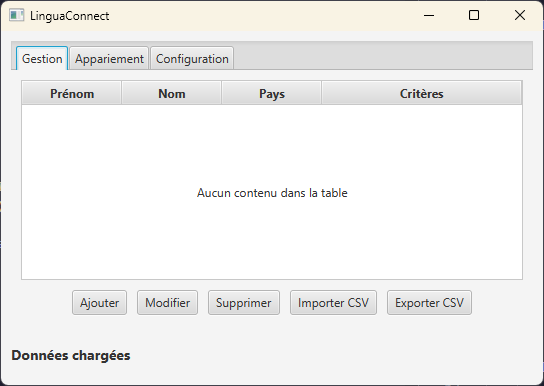
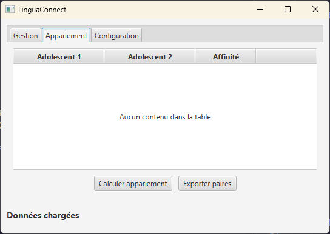

# Rapport SAE 2.01-2.02

## Instructions

## explication des classes

le développement de ce projet à été divisé en deux parties principales, le code et l'interface.

### Code

il y a 6 classes dans cette partie :

- Person
- Pair
- Plateform
- Critere
- CSVHandler
- Pays

#### Person

#### Pair

#### Plateform

classe s'occupant d'une bonne partie des fonctions du controller.

#### Critere

classe gérant les critéres permettant de mettre en relation les adolescents.

#### CSVHandler

classe qui permet de load ou de save les etudiants et paires depuis et dans des fichiers csv.

#### Pays

enum contenant les pays.

## Capture d'écran de l'application finale

## Nos choix de conception

Nous avons fait attention à la lisibilité de notre application avec une couleur de caractère se détachant bien du fond de l'application.
Afin de ne pas surcharger les utilsateurs d'informations, nous avons décider de séparer les différentes parties de l'application dans trois tabs différentes. Cela permet également de fluidifier l'expérience utilisateur.

## Contribution de chaques membres

la partie de code à principalement été réalisé pas Adam et la partie de l'interface par Martin.

### Ressources

[lien vers la maquette Figma](https://www.figma.com/design/ZTCl0GuIiNFMQy3enEJdM5/Prototype_Application_SeaDev?node-id=0-1&p=f&t=96MRWDUvw573MIHx-0#-1)  

### Les membres du groupe ayant travaillé sur la partie IHM

STIEVENARD Adam
LELEU Benjamin
LECOESTER Martin
